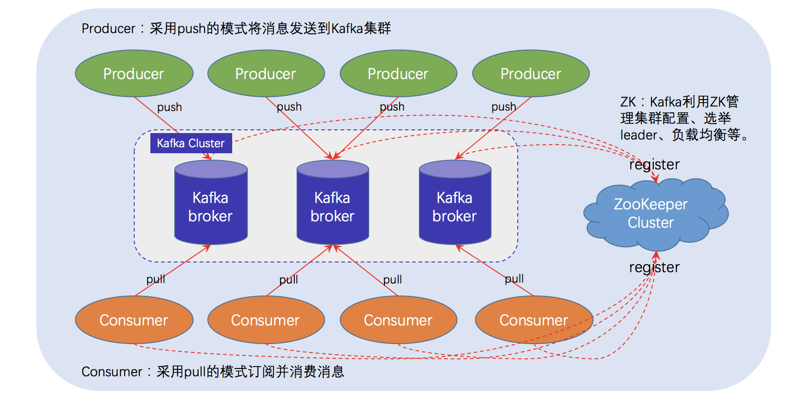
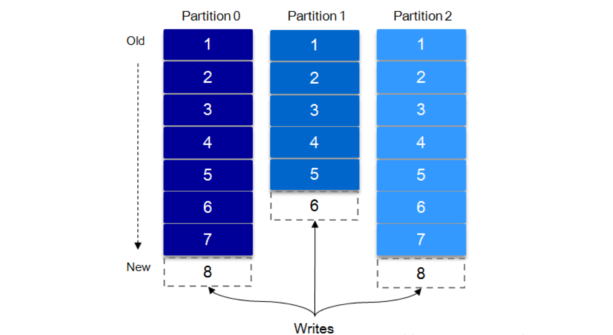
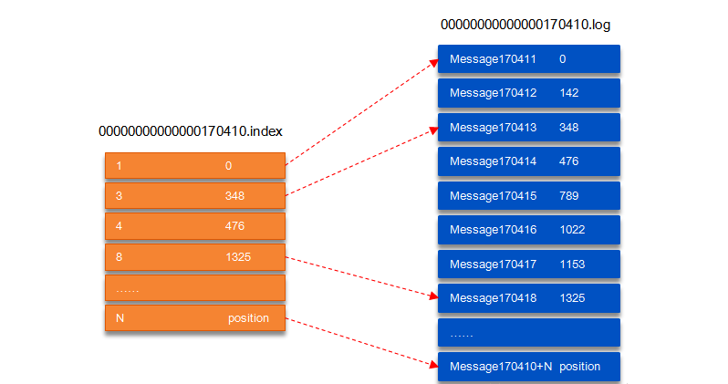

## Kafka 总体架构
基于 Kafka-ZooKeeper 的分布式消息队列系统总体架构如下：



如上图所示，一个典型的 Kafka 体系架构包括若干 Producer（消息生产者），若干 broker（作为 Kafka 节点的服务器），若干 Consumer（Group），以及一个 ZooKeeper 集群。Kafka通过 ZooKeeper 管理集群配置、选举 Leader 以及在 consumer group 发生变化时进行 Rebalance（即消费者负载均衡）。Producer 使用 push（推）模式将消息发布到 broker，Consumer 使用 pull（拉）模式从 broker 订阅并消费消息。

上图仅描摹了一个总体架构，并没有对作为 Kafka 节点的 broker 进行深入刻画，事实上，它的内部细节相当复杂，如下图所示，Kafka 节点涉及 Topic、Partition 两个重要概念。


在 Kafka 架构中，有几个术语：

* **Producer**：生产者，即消息发送者，push 消息到 Kafka 集群中的 broker（就是 server）中；
* **Broker**：Kafka 集群由多个 Kafka 实例（server） 组成，每个实例构成一个 broker，说白了就是服务器；
* **Topic**：producer 向 kafka 集群 push 的消息会被归于某一类别，即Topic，这本质上只是一个逻辑概念，面向的对象是 producer 和 consumer，producer 只需要关注将消息 push 到哪一个 Topic 中，而 consumer 只需要关心自己订阅了哪个 Topic；
* **Partition**：每一个 Topic 又被分为多个 Partitions，即物理分区；出于负载均衡的考虑，同一个 Topic 的 Partitions 分别存储于 Kafka 集群的多个 broker 上；而为了提高可靠性，这些 Partitions 可以由 Kafka 机制中的 replicas 来设置备份的数量；如上面的框架图所示，每个 partition 都存在两个备份；
* **Consumer**：消费者，从 Kafka 集群的 broker 中 pull 消息、消费消息；
* **Consumer group**：high-level consumer API 中，每个 consumer 都属于一个 consumer-group，每条消息只能被 consumer-group 中的一个 Consumer 消费，但可以被多个 consumer-group 消费；
* **replicas**：partition 的副本，保障 partition 的高可用；
* **leader**：replicas 中的一个角色， producer 和 consumer 只跟 leader 交互；
* **follower**：replicas 中的一个角色，从 leader 中复制数据，作为副本，一旦 leader 挂掉，会从它的 followers 中选举出一个新的 leader 继续提供服务；
* **controller**：Kafka 集群中的其中一个服务器，用来进行 leader election 以及 各种 failover；
* **ZooKeeper**：Kafka 通过 ZooKeeper 来存储集群的 meta 信息等，文中将详述。

### Topic & Partition
一个 topic 可以认为是一类消息，每个 topic 将被分成多个 partition，每个 partition 在存储层面是 append log 文件。任何发布到此 partition 的消息都会被追加到log文件的尾部，每条消息在文件中的位置称为 offset（偏移量），offset 为一个 long 型的数字，它唯一标记一条消息。 Kafka 机制中，producer push 来的消息是追加（append）到 partition 中的，这是一种顺序写磁盘的机制，效率远高于随机写内存，如下示意图：



#### Kafka 为什么要将 Topic 进行分区？
>简而言之：负载均衡 + 水平扩展。

前已述及，Topic 只是逻辑概念，面向的是 producer 和 consumer；而 Partition 则是物理概念。可以想象，如果 Topic 不进行分区，而将 Topic 内的消息存储于一个 broker，那么关于该 Topic 的所有读写请求都将由这一个 broker 处理，吞吐量很容易陷入瓶颈，这显然是不符合高吞吐量应用场景的。有了 Partition 概念以后，假设一个 Topic 被分为 10 个 Partitions，Kafka 会根据一定的算法将 10 个 Partition 尽可能均匀的分布到不同的 broker（服务器）上，当 producer 发布消息时，producer 客户端可以采用 random、key-hash 及 轮询 等算法选定目标 partition，若不指定，Kafka 也将根据一定算法将其置于某一分区上。Partiton 机制可以极大的提高吞吐量，并且使得系统具备良好的水平扩展能力。

在创建 topic 时可以在 $KAFKA_HOME/config/server.properties 中指定这个 partition 的数量（如下所示），当然可以在 topic 创建之后去修改 partition 的数量。

```c
# The default number of log partitions per topic. More partitions allow greater
# parallelism for consumption, but this will also result in more files across
# the brokers.
num.partitions=3
```

在发送一条消息时，可以指定这个消息的 key，producer 根据这个 key 和 partition 机制来判断这个消息发送到哪个partition。partition 机制可以通过指定 producer 的 partition.class 这一参数来指定（即支持自定义），该 class 必须实现 kafka.producer.Partitioner 接口。

有关 topic 与 partition 的更多细节，可以参考下面的“Kafka 文件存储机制”这一节。

### Kafka 高可靠性实现基础解读

谈及可靠性，最常规、最有效的策略就是 “副本（replication）机制” ，Kafka 实现高可靠性同样采用了该策略。通过调节副本相关参数，可使 Kafka 在性能和可靠性之间取得平衡。本节先从 Kafka 文件存储机制入手，从最底层了解 Kafka 的存储细节，进而对消息的存储有个微观的认知。之后通过介绍 Kafka 的复制原理和同步方式来阐述宏观层面的概念。最后介绍 ISR，HW 和 leader 选举。

#### Kafka 文件存储机制

Kafka 中消息是以 topic 进行分类的，生产者通过 topic 向 Kafka broker 发送消息，消费者通过 topic 读取数据。然而 topic 在物理层面又能以 partition 为分组，一个 topic 可以分成若干个 partition。事实上，partition 并不是最终的存储粒度，partition 还可以细分为 segment，一个 partition 物理上由多个 segment 组成，那么这些 segment 又是什么呢？

为了便于说明问题，假设这里只有一个 Kafka 集群，且这个集群只有一个 Kafka broker，即只有一台物理机。在这个 Kafka broker 中配置 log.dirs=/tmp/kafka-logs，以此来设置 Kafka 消息文件存储目录；与此同时，通过命令创建一个 topic：mytopic_test，partition 的数量配置为 4（创建 topic 的命令请见上一课）。之后，可以在 /tmp/kafka-logs 目录中可以看到生成了 4 个目录：

```c
drwxr-xr-x 2 root root 4096 Apr 15 13:21 mytopic_test-0
drwxr-xr-x 2 root root 4096 Apr 15 13:21 mytopic_test-1
drwxr-xr-x 2 root root 4096 Apr 15 13:21 mytopic_test-2
drwxr-xr-x 2 root root 4096 Apr 15 13:21 mytopic_test-3
```

在 Kafka 文件存储中，同一个 topic 下有多个不同的 partition，每个 partiton 为一个目录，partition 的名称规则为：topic 名称 + 有序序号，第一个序号从 0 开始计，最大的序号为 partition 数量减 1，partition 是实际物理上的概念，而 topic 是逻辑上的概念。

**问题 1：为什么不能以 partition 作为存储单位？**

上面提到 partition 还可以细分为 segment，这个 segment 又是什么？如果就以 partition 为最小存储单位，可以想象，当 Kafka producer 不断发送消息，必然会引起 partition 文件的无限扩张，将对消息文件的维护以及已消费的消息的清理带来严重的影响，因此，需以 segment 为单位将 partition 进一步细分。每个 partition（目录）相当于一个巨型文件被平均分配到多个大小相等的 segment（段）数据文件中（每个 segment 文件中消息数量不一定相等）这种特性也方便 old segment 的删除，即方便已被消费的消息的清理，提高磁盘的利用率。每个 partition 只需要支持顺序读写就行，segment 的文件生命周期由服务端配置参数（log.segment.bytes，log.roll.{ms,hours} 等若干参数）决定。

**问题 2：segment 的工作原理是怎样的？**

segment 文件由两部分组成，分别为 “.index” 文件和 “.log” 文件，分别表示为 segment 索引文件和数据文件。这两个文件的命令规则为：partition 全局的第一个 segment 从 0 开始，后续每个 segment 文件名为上一个 segment 文件最后一条消息的 offset 值，数值大小为 64 位，20 位数字字符长度，没有数字用 0 填充，如下：

```
00000000000000000000.index
00000000000000000000.log
00000000000000170410.index
00000000000000170410.log
00000000000000239430.index
00000000000000239430.log
```
以上面的 segment 文件为例，展示出 segment：00000000000000170410 的 “.index” 文件和 “.log” 文件的对应的关系，如下图：



如上图，“.index” 索引文件存储大量的元数据，“.log” 数据文件存储大量的消息，索引文件中的元数据指向对应数据文件中 message 的物理偏移地址。其中以 “.index” 索引文件中的元数据 [3, 348] 为例，在 “.log” 数据文件表示第 3 个消息，即在全局 partition 中表示 170410+3=170413 个消息，该消息的物理偏移地址为 348。

**问题 3：如何从 partition 中通过 offset 查找 message 呢？**

以上图为例，读取 offset=170418 的消息，首先查找 segment 文件，其中 00000000000000000000.index 为最开始的文件，第二个文件为 00000000000000170410.index（起始偏移为 170410+1=170411），而第三个文件为 00000000000000239430.index（起始偏移为 239430+1=239431），所以这个 offset=170418 就落到了第二个文件之中。其它后续文件可以依次类推，以其偏移量命名并排列这些文件，然后根据二分查找法就可以快速定位到具体文件位置。其次根据 00000000000000170410.index 文件中的 [8,1325] 定位到 00000000000000170410.log 文件中的 1325 的位置进行读取。

要是读取 offset=170418 的消息，从 00000000000000170410.log 文件中的 1325 的位置进行读取，那么，如何确定何时读完本条消息呢？（否则就读到下一条消息的内容了）

这个问题由消息的物理结构解决，消息都具有固定的物理结构，包括：offset（8 Bytes）、消息体的大小（4 Bytes）、crc32（4 Bytes）、magic（1 Byte）、attributes（1 Byte）、key length（4 Bytes）、key（K Bytes）、payload（N Bytes）等等字段，可以确定一条消息的大小，即读取到哪里截止。

#### 复制原理和同步方式
```go
func (cb *CourseBiz) UpdateCourseBizStatus(r *course.UpdateCourseBizStatusRequest)(resp *course.UpdateCourseBizStatusResponse ,err error) {
	resp = &course.UpdateCourseBizStatusResponse{
		BaseResp: &base.BaseResp{
			StatusMessage: "success",
			StatusCode:    0,
		},
	}

	defer func() {
		if err != nil {
			resp.BaseResp.StatusCode, resp.BaseResp.StatusMessage = exerr.GetErrorMsg(err)
			logs.CtxError(cb.ctx, "UpdateCourseBizStatus error=%s", err)
		}
	}()

	courseBizDal := dal.NewCourseBizDal(cb.ctx)
	err = courseBizDal.UpdateStatus(r.GetCourseBizId(), int16(r.GetStatus()), r.GetExtra())
	if err != nil {
		logs.CtxError(cb.ctx, "UpdateCourseBizStatus error, err=%v", err)
		return resp, err
	}
	return resp, nil
}
```
